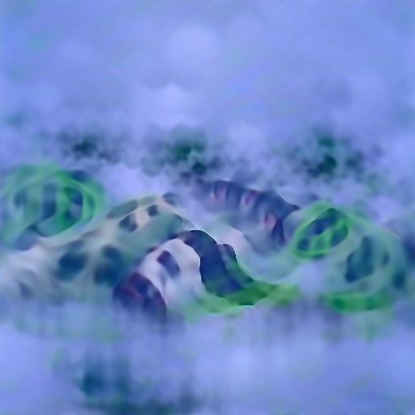
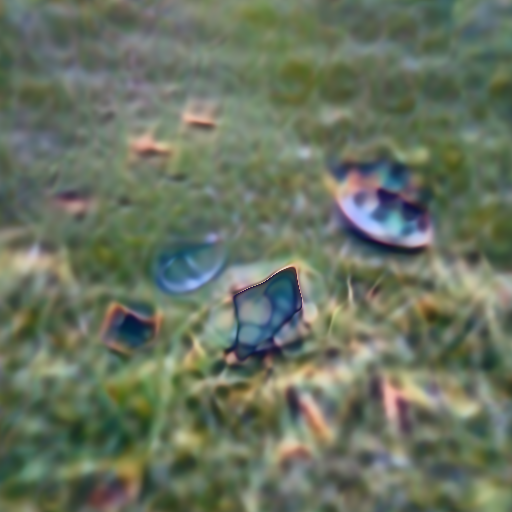
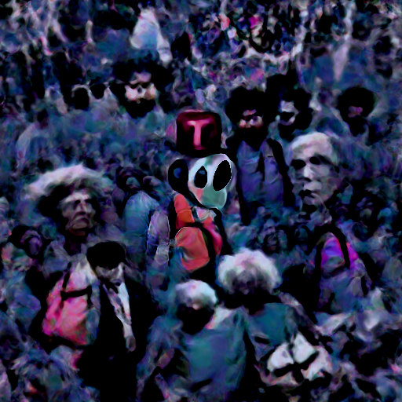
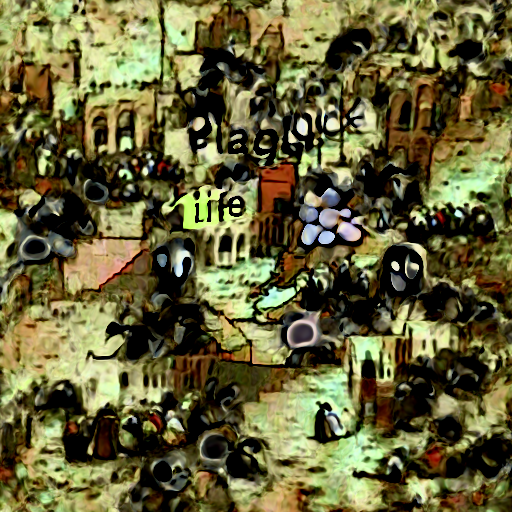
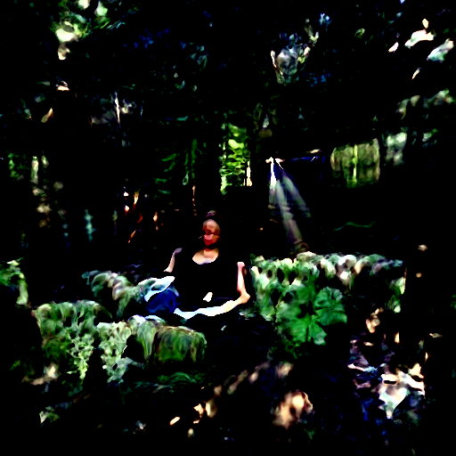
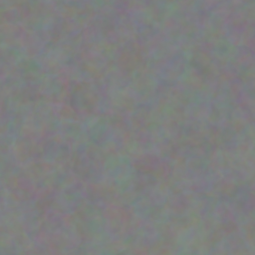
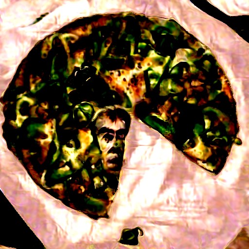

## Deep Daze

</img>

*mist over green hills*

</img>

*shattered plates on the grass*

</img>

*cosmic love and attention*

</img>

*a time traveler in the crowd*

</img>

*life during the plague*

</img>

*meditative peace in a sunlit forest*

## What is this?

Simple command line tool for text to image generation using OpenAI's <a href="https://github.com/openai/CLIP">CLIP</a> and <a href="https://arxiv.org/abs/2006.09661">Siren</a>. Credit goes to <a href="https://twitter.com/advadnoun">Ryan Murdock</a> for the discovery of this technique (and for coming up with the great name)!

Original notebook [![Open In Colab][colab-badge]][colab-notebook]

New simplified notebook [![Open In Colab][colab-badge]][colab-notebook-2]

[colab-notebook]: <https://colab.research.google.com/drive/1FoHdqoqKntliaQKnMoNs3yn5EALqWtvP>
[colab-notebook-2]: <https://colab.research.google.com/drive/1_YOHdORb0Fg1Q7vWZ_KlrtFe9Ur3pmVj?usp=sharing>
[colab-badge]: <https://colab.research.google.com/assets/colab-badge.svg>

This will require that you have an Nvidia GPU

## Install

```bash
$ pip install deep-daze
```

## Examples

```bash
$ imagine "a house in the forest"
```

That's it.

If you have enough memory, you can get better quality by adding a `--deeper` flag

```bash
$ imagine "shattered plates on the ground" --deeper
```

### Advanced

In true deep learning fashion, more layers will yield better results. Default is at `16`, but can be increased to `32` depending on your resources.

```bash
$ imagine "stranger in strange lands" --num-layers 32
```

## Usage

### CLI
```bash
NAME
    imagine

SYNOPSIS
    imagine TEXT <flags>

POSITIONAL ARGUMENTS
    TEXT
        (required) A phrase less than 77 characters which you would like to visualize.

FLAGS
    --learning_rate=LEARNING_RATE
        Default: 1e-05
        The learning rate of the neural net.
    --num_layers=NUM_LAYERS
        Default: 16
        The number of hidden layers to use in the Siren neural net.
    --batch_size=BATCH_SIZE
        Default: 4
        The number of generated images to pass into Siren before calculating loss. Decreasing this can lower memory and accuracy.
    --gradient_accumulate_every=GRADIENT_ACCUMULATE_EVERY
        Default: 4
        Calculate a weighted loss of n samples for each iteration. Increasing this can help increase accuracy with lower batch sizes.
    --epochs=EPOCHS
        Default: 20
        The number of epochs to run.
    --iterations=ITERATIONS
        Default: 1050
        The number of times to calculate and backpropagate loss in a given epoch.
    --save_every=SAVE_EVERY
        Default: 100
        Generate an image every time iterations is a multiple of this number.
    --image_width=IMAGE_WIDTH
        Default: 512
        The desired resolution of the image.
    --deeper=DEEPER
        Default: False
        Uses a Siren neural net with 32 hidden layers.
    --overwrite=OVERWRITE
        Default: False
        Whether or not to overwrite existing generated images of the same name.
    --save_progress=SAVE_PROGRESS
        Default: False
        Whether or not to save images generated before training Siren is complete.
    --seed=SEED
        Type: Optional[]
        Default: None
        A seed to be used for deterministic runs.
    --open_folder=OPEN_FOLDER
        Default: True
        Whether or not to open a folder showing your generated images.
    --save_date_time=SAVE_DATE_TIME
        Default: False
        Save files with a timestamp prepended e.g. `%y%m%d-%H%M%S-my_phrase_here`
    --start_image_path=START_IMAGE_PATH
        Default: None
        The generator is trained first on a starting image before steered towards the textual input
    --start_image_train_iters=START_IMAGE_TRAIN_ITERS
        Default: 50
        The number of steps for the initial training on the starting image
    --theta_initial=THETA_INITIAL
        Default: 30.0
        Hyperparameter describing the frequency of the color space. Only applies to the first layer of the network.
    --theta_hidden=THETA_INITIAL
        Default: 30.0
        Hyperparameter describing the frequency of the color space. Only applies to the hidden layers of the network.
```

### Priming

Technique first devised and shared by <a href="https://twitter.com/quasimondo">Mario Klingemann</a>, it allows you to prime the generator network with a starting image, before being steered towards the text.

Simply specify the path to the image you wish to use, and optionally the number of initial training steps.

```bash
$ imagine 'a clear night sky filled with stars' --start-image-path ./cloudy-night-sky.jpg
```

Primed starting image

</img>

Then trained with the prompt `A pizza with green peppers`

</img>

### Python
#### Invoke `deep_daze.Imagine` in Python
```python
from deep_daze import Imagine

imagine = Imagine(
    text = 'cosmic love and attention',
    num_layers = 24,
)
imagine()
```

#### Save progress every fourth iteration
Save images in the format insert_text_here.00001.png, insert_text_here.00002.png, ...up to `(total_iterations % save_every)`
```python
imagine = Imagine(
    text=text,
    save_every=4,
    save_progress=True
)
```

#### Prepend current timestamp on each image.
Creates files with both the timestamp and the sequence number.

e.g. 210129-043928_328751_insert_text_here.00001.png, 210129-043928_512351_insert_text_here.00002.png, ...
```python
imagine = Imagine(
    text=text,
    save_every=4,
    save_progress=True,
    save_date_time=True,
)
```

#### High GPU memory usage
If you have at least 16 GiB of vram available, you should be able to run these settings with some wiggle room.
```python
imagine = Imagine(
    text=text,
    num_layers=42,
    batch_size=64,
    gradient_accumulate_every=1,
)
```

#### Average GPU memory usage
```python
imagine = Imagine(
    text=text,
    num_layers=24,
    batch_size=16,
    gradient_accumulate_every=2
)
```

#### Very low GPU memory usage (less than 4 GiB)
If you are desperate to run this on a card with less than 8 GiB vram, you can lower the image_width.
```python
imagine = Imagine(
    text=text,
    image_width=256,
    num_layers=16,
    batch_size=1,
    gradient_accumulate_every=16 # Increase gradient_accumulate_every to correct for loss in low batch sizes
)
```

## Where is this going?

This is just a teaser. We will be able to generate images, sound, anything at will, with natural language. The holodeck is about to become real in our lifetimes.

Please join replication efforts for DALL-E for <a href="https://github.com/lucidrains/dalle-pytorch">Pytorch</a> or <a href="https://github.com/EleutherAI/DALLE-mtf">Mesh Tensorflow</a> if you are interested in furthering this technology.

## Alternatives

<a href="https://github.com/lucidrains/big-sleep">Big Sleep</a> - CLIP and the generator from Big GAN

## Citations

```bibtex
@misc{unpublished2021clip,
    title  = {CLIP: Connecting Text and Images},
    author = {Alec Radford, Ilya Sutskever, Jong Wook Kim, Gretchen Krueger, Sandhini Agarwal},
    year   = {2021}
}
```

```bibtex
@misc{sitzmann2020implicit,
    title   = {Implicit Neural Representations with Periodic Activation Functions},
    author  = {Vincent Sitzmann and Julien N. P. Martel and Alexander W. Bergman and David B. Lindell and Gordon Wetzstein},
    year    = {2020},
    eprint  = {2006.09661},
    archivePrefix = {arXiv},
    primaryClass = {cs.CV}
}
```

[colab-notebook]: <https://colab.research.google.com/drive/1FoHdqoqKntliaQKnMoNs3yn5EALqWtvP>
